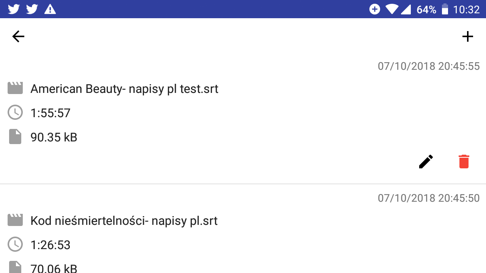

# Deaftitles
Aplikacja tworzona, aby pomóc osobom głuchoniemym.

Wiele Polskich jak i zagranicznych filmów granych w kinach nie posiada wersji przeznaczonej dla osób głuchoniemych. Deaftitles w zamyśle ma pomóc takim osobom.
Aplikacja na ekranie smartfona wyświetla obraz z kamery, na który nakładane są napisy i wyświetlane są w czasie rzeczywistym.

# Screenshots

